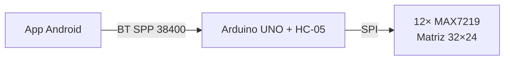
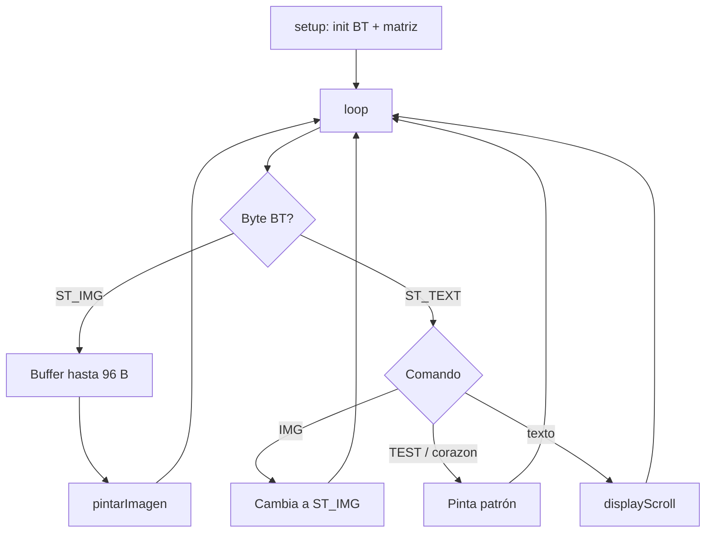

# ArduinoPixelLink — Firmware PixelLink (32 × 24)

> Firmware Arduino para una pantalla matricial **32 × 24** construida con doce módulos **MAX7219 8×8 (FC-16)** organizados en cuadrícula **4 × 3**, controlada de forma inalámbrica desde Android mediante **Bluetooth SPP** (HC-05 / HC-06).
>
> Aplicación móvil compañera: **[David-Albarracin/PixelLink](https://github.com/David-Albarracin/PixelLink)**.

---

## Índice

1. [Contexto académico](#contexto-académico)
2. [Descripción general](#descripción-general)
3. [Características](#características)
4. [Arquitectura del sistema](#arquitectura-del-sistema)
5. [Diagrama de flujo](#diagrama-de-flujo)
6. [Hardware y materiales (BOM)](#hardware-y-materiales-bom)
7. [Esquema de conexiones](#esquema-de-conexiones)
8. [Herramientas de software](#herramientas-de-software)
9. [Despliegue paso a paso](#despliegue-paso-a-paso)
10. [Protocolo de comunicación](#protocolo-de-comunicación)
11. [Calibración de orientación](#calibración-de-orientación)
12. [Estructura del proyecto](#estructura-del-proyecto)
13. [Solución de problemas](#solución-de-problemas)
14. [Licencia y créditos](#licencia-y-créditos)

---

## Contexto académico

| Campo | Detalle |
|------|---------|
| Institución | **Unidades Tecnológicas de Santander (UTS)** |
| Colaboradores | [@David-Albarracin](https://github.com/David-Albarracin) · [@jersonortiz1517-collab](https://github.com/jersonortiz1517-collab) |
| Repositorio firmware | `ArduinoPixelLink` |
| Repositorio app | [`PixelLink`](https://github.com/David-Albarracin/PixelLink) |
| Tipo de proyecto | Sistema embebido + aplicación Android |
| Año | 2026 |

Proyecto integrador de electrónica digital, comunicaciones inalámbricas y desarrollo móvil. Demuestra interoperabilidad entre un microcontrolador AVR y un dispositivo Android mediante un protocolo binario / textual propio sobre Bluetooth SPP.

---

## Descripción general

**PixelLink** es un sistema cliente–servidor de visualización LED. El microcontrolador actúa como servidor de píxeles: recibe comandos por Bluetooth, los interpreta y los renderiza sobre una matriz física de **768 LEDs monocromos** (32 × 24).

La aplicación Android permite al usuario:

- Escribir texto que se desplaza horizontalmente (scroll) en la matriz.
- Dibujar o cargar un bitmap monocromo de 32 × 24 píxeles y enviarlo como imagen.
- Disparar patrones predefinidos (`TEST`, `corazon`).

El firmware mantiene una **máquina de estados** muy simple (`ST_TEXT` / `ST_IMG`) que distingue entre comandos ASCII y carga binaria de imagen.

---

## Características

- ✅ Resolución física **32 × 24** (4 × 3 módulos MAX7219).
- ✅ Comunicación Bluetooth a **38400 baudios** mediante `SoftwareSerial` con buffer RX ampliado a 128 bytes.
- ✅ Renderizado de texto con scroll suave (librería **MD_Parola**).
- ✅ Renderizado de bitmaps monocromos de **96 bytes** (1 bit por píxel, MSB primero, row-major).
- ✅ Patrón de calibración `TEST` con marcas asimétricas en las cuatro esquinas + letra «F» central para identificar rotaciones y espejados.
- ✅ Flags de orientación en tiempo de compilación: `INVERT_X`, `INVERT_Y`, `MOD_X_REVERSE`, `MOD_Y_REVERSE`, `MODULE_TRANSPOSE`.
- ✅ Animación de scroll **no interfiere** con bitmaps estáticos (flag `showingImage`).
- ✅ Compilación reproducible con **PlatformIO**.

---

## Arquitectura del sistema



- **Presentación:** app Android.
- **Transporte:** Bluetooth SPP.
- **Firmware:** este repositorio.
- **Salida física:** matrices MAX7219 vía SPI.

---

## Diagrama de flujo

Flujo principal del firmware (`loop()`):



---

## Hardware y materiales (BOM)

| Cant. | Componente | Especificación | Notas |
|:----:|------------|----------------|-------|
| 1 | Arduino UNO R3 | ATmega328P, 16 MHz | También compatible con MEGA 2560 (env `megaatmega2560`) |
| 12 | Módulo matriz LED 8×8 | Driver **MAX7219**, formato **FC-16** | Encadenadas en serie SPI |
| 1 | Módulo Bluetooth | **HC-05** o **HC-06** | Configurar a **38400 baudios** |
| 1 | Fuente de alimentación | **5 V / ≥ 3 A** | Imprescindible: 12 módulos pueden demandar > 2 A a brillo alto |
| 2 | Resistencias | 1 kΩ y 2 kΩ | Divisor de tensión para RX del HC-05 (5 V → 3.3 V) |
| 1 | Cable USB | Tipo B | Programación y monitor serie |
| — | Cables Dupont / soldadura / protoboard | — | Cableado SPI y alimentación |
| 1 | Estructura / marco | Madera, PLA o acrílico | Soporte físico para la cuadrícula 4 × 3 |

> ⚠️ **Importante:** alimentar las matrices **desde la fuente externa**, no desde el pin 5 V del Arduino. Unir **GND común** entre fuente, Arduino y módulos.

---

## Esquema de conexiones

### Matrices MAX7219 (cadena SPI)

| Pin Arduino UNO | Señal | Pin módulo MAX7219 |
|:--------------:|:-----:|:------------------:|
| **D11** | DATA / MOSI | DIN |
| **D13** | CLK / SCK   | CLK |
| **D10** | CS / SS     | CS  |
| **5 V (fuente externa)** | VCC | VCC |
| **GND** (común) | GND | GND |

Las 12 matrices se conectan en cadena: `DOUT` de un módulo → `DIN` del siguiente.

### Módulo Bluetooth HC-05 / HC-06

| Pin Arduino UNO | Señal | Pin HC-05 |
|:--------------:|:-----:|:---------:|
| **D3** | RX Arduino ← TX HC | **TXD** |
| **D5** (a través de divisor 1 k / 2 k) | TX Arduino → RX HC | **RXD** |
| **5 V** | VCC | VCC |
| **GND** | GND | GND |

> El HC-05 acepta 3.3 V lógico en su RX. Si se conecta directo desde un pin a 5 V puede degradarse con el tiempo: **usar divisor de tensión**.

---

## Herramientas de software

| Herramienta | Versión recomendada | Uso |
|------------|--------------------|-----|
| **PlatformIO Core** o **PlatformIO IDE (VSCode)** | ≥ 6.1 | Compilación y carga del firmware |
| **VSCode** | Última estable | Editor recomendado |
| **Arduino IDE** *(alternativo)* | ≥ 2.0 | Opcional si no se usa PlatformIO |
| **Android Studio** | Última estable | Solo para compilar la app `PixelLink` |
| Librería **MD_MAX72XX** | `^3.5.1` | Driver de bajo nivel |
| Librería **MD_Parola** | `^3.7.3` | Scroll y animaciones |
| Aplicación Android **PixelLink** | [`David-Albarracin/PixelLink`](https://github.com/David-Albarracin/PixelLink) | Cliente Bluetooth |

Las librerías se instalan automáticamente leyendo `platformio.ini`. No hace falta instalarlas a mano.

---

## Despliegue paso a paso

### 1. Clonar el repositorio

```bash
git clone https://github.com/David-Albarracin/ArduinoPixelLink.git
cd ArduinoPixelLink
```

### 2. Instalar PlatformIO

Opción A — **VSCode (recomendado):** instalar la extensión *PlatformIO IDE*.
Opción B — **CLI:**

```bash
pip install platformio
```

### 3. Conectar el hardware

Cablear según las tablas de [Esquema de conexiones](#esquema-de-conexiones). Verificar:

- GND común entre Arduino, fuente y matrices.
- Fuente externa de 5 V conectada **solo** a las matrices y al HC-05.
- HC-05 emparejado previamente con el teléfono (PIN típico `1234` o `0000`).

### 4. Compilar y cargar el firmware

Con el UNO conectado por USB:

```bash
pio run -e uno -t upload
```

Si PlatformIO no detecta el puerto, descomentar `upload_port = COMx` en `platformio.ini`.

Para Arduino MEGA 2560:

```bash
pio run -e megaatmega2560 -t upload
```

### 5. Abrir el monitor serie (opcional)

```bash
pio device monitor -b 9600
```

Salida esperada al arrancar:

```
PixelLink listo (32x24).
Comandos: TEST | IMG | corazon | <texto>
```

### 6. Instalar la app Android

1. Clonar [`PixelLink`](https://github.com/David-Albarracin/PixelLink).
2. Abrir el proyecto en **Android Studio**.
3. Generar el APK (`Build → Build Bundle(s) / APK(s)`) o ejecutarlo en un dispositivo físico.
4. Emparejar el teléfono con el **HC-05** desde los ajustes Bluetooth del sistema.
5. Abrir la app PixelLink, seleccionar el HC-05 y empezar a enviar texto e imágenes.

### 7. Prueba de calibración

Antes del primer uso, enviar desde la app la palabra **`TEST`** (sin comillas). La matriz debe mostrar:

- Esquina superior izquierda: **1 píxel**.
- Esquina superior derecha: **línea horizontal de 3 px**.
- Esquina inferior izquierda: **línea vertical de 3 px**.
- Esquina inferior derecha: **cuadrado 3 × 3**.
- Centro: **letra «F» grande**.

Si la imagen aparece rotada o espejada, ajustar los flags descritos en la siguiente sección.

---

## Protocolo de comunicación

El firmware acepta tres tipos de tramas sobre el enlace Bluetooth serie:

### Texto libre

Cadena ASCII terminada en `\n` (o tras 300 ms de silencio). Se muestra con scroll horizontal.

```
Hola UTS\n
```

### Comandos especiales

| Comando | Efecto |
|---------|--------|
| `TEST\n` | Patrón de calibración |
| `corazon\n` / `heart\n` | Corazón hardcodeado 24 × 20 |
| `IMG\n` | Entra en modo binario: los siguientes **96 bytes** son el bitmap |

### Trama de imagen (`IMG`)

1. Cliente envía: `IMG\n`.
2. Arduino responde por monitor serie: `Modo IMG: esperando 96 bytes...`.
3. Cliente envía exactamente **96 bytes binarios**:
   - 32 × 24 = 768 píxeles.
   - 1 bit por píxel, **MSB primero**.
   - Orden **row-major** (de arriba-izquierda a abajo-derecha, fila por fila).
4. Tras el byte 96 el firmware vuelve a `ST_TEXT` y renderiza la imagen.

> El buffer `_SS_MAX_RX_BUFF` se eleva a **128 bytes** para tolerar ráfagas.

---

## Calibración de orientación

Si tras enviar `TEST` la imagen aparece girada o espejada, modificar las macros al inicio de [`src/main.cpp`](src/main.cpp#L57) y recompilar:

| Macro | Valores | Efecto |
|------|---------|--------|
| `INVERT_X` | 0 / 1 | Espejo horizontal global |
| `INVERT_Y` | 0 / 1 | Espejo vertical global |
| `MOD_X_REVERSE` | 0 / 1 | Invierte el orden de los módulos dentro de cada fila |
| `MOD_Y_REVERSE` | 0 / 1 | Invierte el orden de las filas de módulos |
| `MODULE_TRANSPOSE` | 0 / 1 | Rota 90° cada módulo individual |

Combinaciones frecuentes:

| Síntoma | Ajuste sugerido |
|---------|-----------------|
| Imagen espejada horizontal | `INVERT_X = 1` |
| Imagen cabeza abajo | `INVERT_X = 1` + `INVERT_Y = 1` |
| Imagen girada 90° | `MODULE_TRANSPOSE = 1` (+ ajustar inverts si hace falta) |

---

## Estructura del proyecto

```
ArduinoPixelLink/
├── include/              # Cabeceras (vacío)
├── lib/                  # Librerías locales (vacío)
├── src/
│   └── main.cpp          # Firmware completo
├── test/                 # Pruebas unitarias (vacío)
├── platformio.ini        # Configuración de entornos UNO y MEGA
└── README.md             # Este documento
```

---

## Solución de problemas

| Síntoma | Causa probable | Acción |
|---------|----------------|--------|
| La matriz no enciende | Falta GND común o fuente insuficiente | Verificar GND común y fuente ≥ 3 A |
| Solo encienden algunas matrices | Mal contacto en cadena DIN/DOUT | Revisar soldaduras / cableado |
| El texto aparece pero la imagen sale corrupta | Buffer RX desbordado | Confirmar `_SS_MAX_RX_BUFF = 128` en compilación |
| Texto e imagen se ven mezclados | Animación de scroll corre sobre el bitmap | Ya corregido con flag `showingImage`. Recompilar última versión |
| HC-05 no aparece en el celular | Sin alimentación / modo AT activo | Conectar correctamente VCC/GND y salir del modo AT |
| `Could not open port COMx` | Puerto ocupado por el monitor serie | Cerrar monitor antes de cargar |
| Imagen rotada o espejada | Orientación física distinta | Ajustar flags `INVERT_*` y recompilar |

---

## Licencia y créditos

- **Colaboradores:** [@David-Albarracin](https://github.com/David-Albarracin) · [@jersonortiz1517-collab](https://github.com/jersonortiz1517-collab) — Unidades Tecnológicas de Santander (UTS).
- **Librerías de terceros:** [MD_MAX72XX](https://github.com/MajicDesigns/MD_MAX72XX) y [MD_Parola](https://github.com/MajicDesigns/MD_Parola) de MajicDesigns (LGPL-2.1).
- **Aplicación Android compañera:** [David-Albarracin/PixelLink](https://github.com/David-Albarracin/PixelLink).

Uso académico y educativo.
